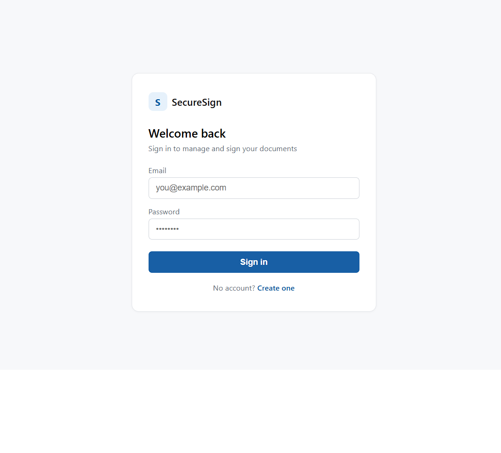
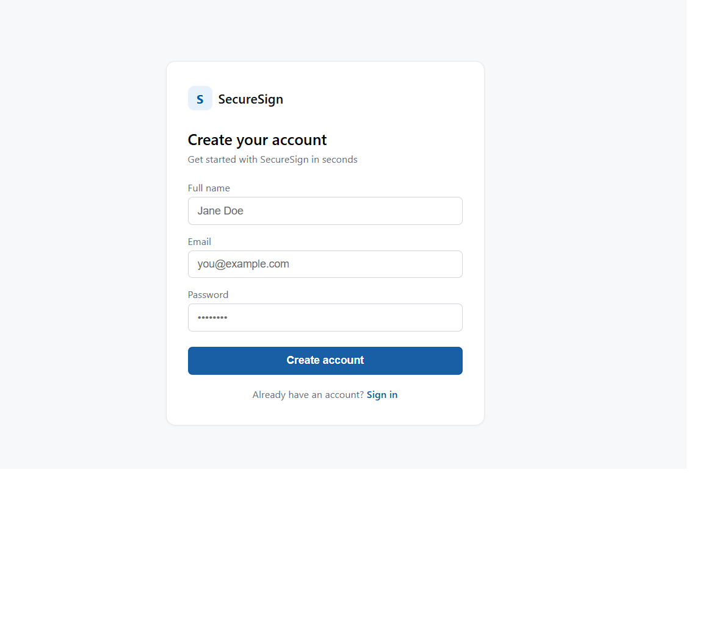
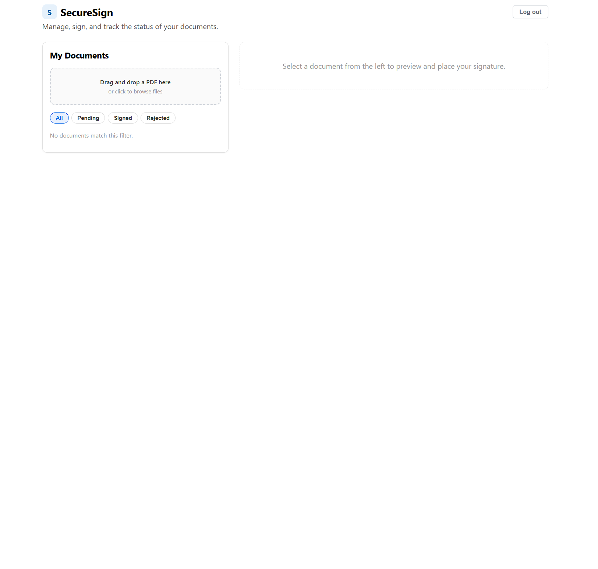
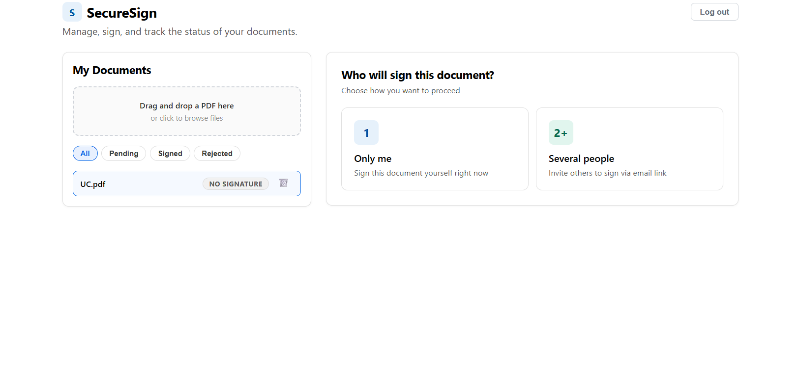
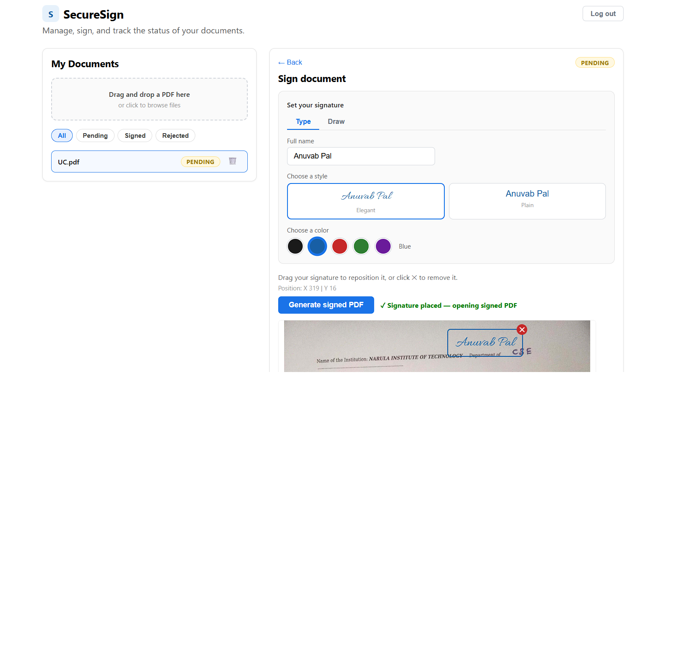
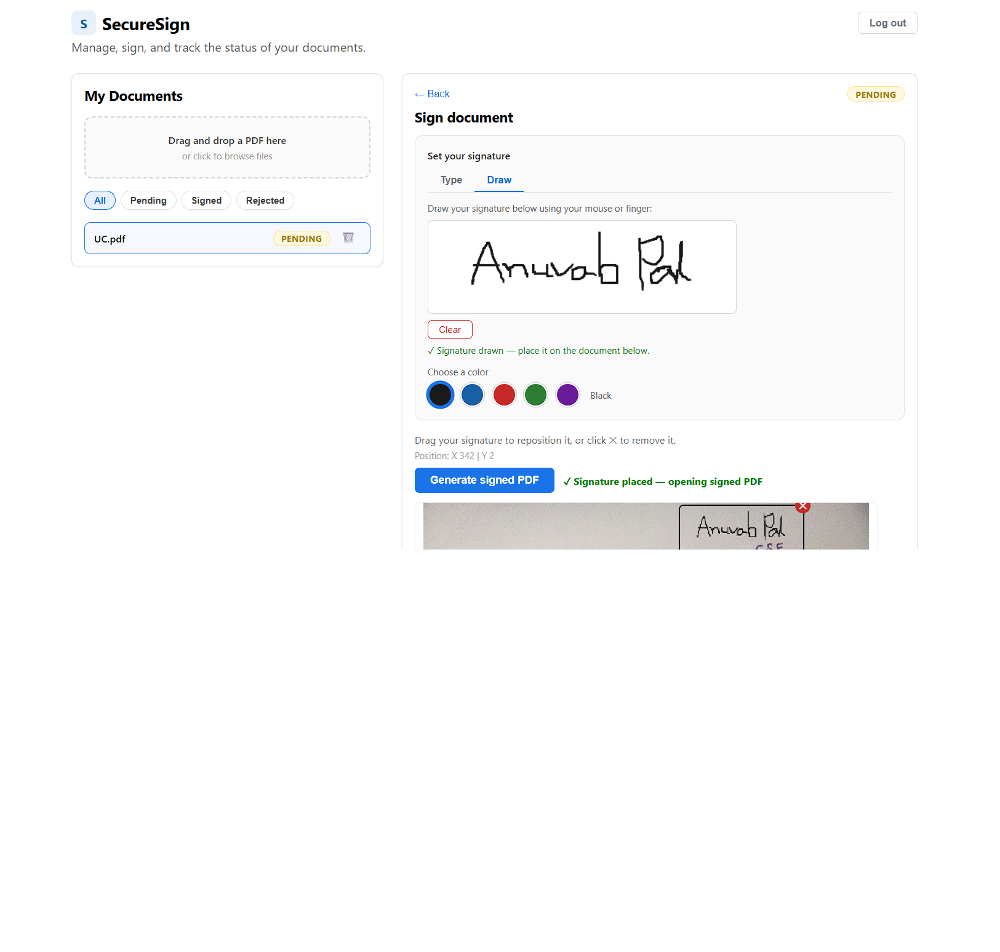
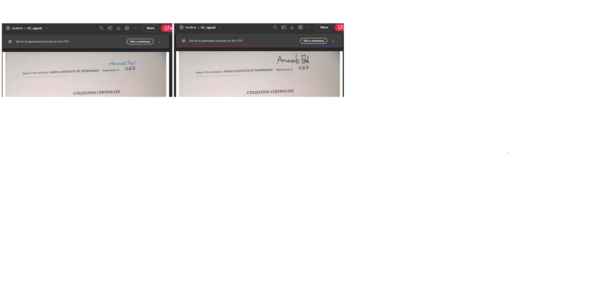

# SecureSign — Digital Document Signature App

SecureSign is a full-stack e-signature web application that lets users register, upload PDF documents, place a personalized signature, and either sign documents themselves or send them to others for signature via email — similar in functionality to tools like iLovePDF's "Sign PDF" feature, with an original UI and branding.

**Live demo:** [https://digital-signature-app-gamma.vercel.app](https://digital-signature-app-gamma.vercel.app)

---

## Screenshots

| Login | Sign Up |
|---|---|
|  |  |

| Dashboard (empty) | Dashboard (with documents) |
|---|---|
|  |  |

| Type Signature | Draw Signature |
|---|---|
|  |  |

## Signature Placed on PDF



---

## Features

- **User authentication** — JWT-based register/login, gating access to the dashboard
- **Document upload** — drag-and-drop or click-to-browse PDF upload
- **Document dashboard** — list of uploaded documents with status badges (Pending / Signed / Rejected) and filters
- **"Who will sign?" flow** — choose between signing the document yourself ("Only me") or sending it to someone else ("Several people")
- **Personalized signatures** — type your name and choose from multiple handwriting-style fonts (Script, Elegant, Handwritten, Plain)
- **Drag-and-drop signature placement** — position your signature anywhere on the document preview
- **Signed PDF generation** — generates a downloadable PDF with the signature stamped onto it
- **Email signing links** — sends a unique signing link to a recipient's email via the Resend API
- **Public signing page** — recipients open the emailed link (no login required) to view the document and Accept or Decline the signature
- **Signature status workflow** — Pending / Signed / Rejected states with audit logging
- **Document management** — delete documents (removes file, signature records, and database entry)

---

## Tech Stack

**Backend**
- Java 21, Spring Boot 3
- Spring Security (JWT authentication)
- Spring Data JPA + Hibernate
- MySQL (hosted on Railway)
- Apache PDFBox (PDF text stamping)
- Resend API (transactional email)
- Docker (containerized deployment)

**Frontend**
- React (Create React App)
- react-pdf (PDF rendering)
- Axios (HTTP client)

**Deployment**
- Backend: Render (Docker)
- Frontend: Vercel
- Database: Railway (MySQL)

---

## Project Structure

```
signature-app/
├── src/
│   └── main/
│       ├── java/com/signature/signatureapp/
│       │   ├── config/
│       │   │   ├── JwtUtils.java
│       │   │   └── SecurityConfig.java
│       │   ├── controller/
│       │   │   ├── AuditLogController.java
│       │   │   ├── AuthController.java
│       │   │   ├── DocumentController.java
│       │   │   ├── PublicSigningController.java
│       │   │   ├── SignatureController.java
│       │   │   └── SignedDocumentController.java
│       │   ├── model/
│       │   │   ├── AuditLog.java
│       │   │   ├── Document.java
│       │   │   ├── Signature.java
│       │   │   ├── SignatureStatus.java
│       │   │   └── User.java
│       │   ├── repository/
│       │   │   ├── AuditLogRepository.java
│       │   │   ├── DocumentRepository.java
│       │   │   ├── SignatureRepository.java
│       │   │   └── UserRepository.java
│       │   └── service/
│       │       ├── AuditLogService.java
│       │       ├── DocumentService.java
│       │       ├── EmailService.java
│       │       ├── SignatureService.java
│       │       ├── SignedDocumentService.java
│       │       └── UserService.java
│       └── resources/
│           └── application.yaml
├── frontend/
│   └── src/
│       ├── App.js          # Routes between Auth and Dashboard
│       ├── Auth.js          # Login / Register screen
│       ├── Dashboard.js     # Main app: upload, sign, manage documents
│       ├── App.css
│       └── index.js
├── Dockerfile
└── pom.xml
```

---

## How It Works

### 1. Authentication
Users register with a name, email, and password. Passwords are hashed with BCrypt. Login returns a JWT token stored in the browser for the session.

### 2. Upload
Users drag and drop (or browse for) a PDF, which is uploaded to the backend and stored, with metadata saved to the database.

### 3. Who will sign?
After selecting a document, the user chooses:
- **Only me** — sign the document themselves
- **Several people** — send the document to someone else's email for signing

### 4. Set your signature
The user types their name and picks a signature style (font). The styled name appears as a draggable element on the PDF preview.

### 5. Sign or send
- **Only me** → clicking "Generate signed PDF" stamps the signature onto the document and opens the signed PDF in a new tab
- **Several people** → entering a recipient's email and clicking "Send to sign" emails them a unique signing link (via Resend)

### 6. Recipient signing (public link)
The recipient opens the emailed link — no account or login required. They see the document preview and the proposed signature placement, and can click **Accept & Sign** (status becomes SIGNED) or **Decline** with an optional reason (status becomes REJECTED).

### 7. Document management
Users can filter documents by status and delete documents they no longer need.

---

## Local Development Setup

### Prerequisites
- Java 21
- Maven
- Node.js & npm
- MySQL (running locally, or use a cloud instance)

### Backend

```bash
# From the project root
$env:DB_USERNAME="your_db_username"
$env:DB_PASSWORD="your_mysql_password"
$env:RESEND_API_KEY="your_resend_api_key"
mvn spring-boot:run
```

The backend runs on `http://localhost:8080`.

### Frontend

```bash
cd frontend
npm install
npm start
```

The frontend runs on `http://localhost:3000`.

### Environment Variables

| Variable | Description | Example |
|---|---|---|
| `DB_URL` | JDBC URL for MySQL | `jdbc:mysql://localhost:3306/signature_app` |
| `DB_USERNAME` | Database username | `root` |
| `DB_PASSWORD` | Database password | `password` |
| `RESEND_API_KEY` | API key for Resend (email sending) | `re_xxxxxxxx` |
| `RESEND_FROM_EMAIL` | Sender email address | `onboarding@resend.dev` |
| `APP_BASE_URL` | Base URL used in signing links | `http://localhost:8080` |
| `REACT_APP_API_URL` | Backend URL for the frontend | `http://localhost:8080` |

---

## API Overview

| Method | Endpoint | Description |
|---|---|---|
| POST | `/api/auth/register` | Register a new user |
| POST | `/api/auth/login` | Login, returns JWT |
| POST | `/api/docs/upload` | Upload a PDF document |
| GET | `/api/docs/user/{userId}` | List a user's documents |
| GET | `/api/docs/view/{id}` | View/stream a document |
| DELETE | `/api/docs/{id}` | Delete a document |
| POST | `/api/signature/save` | Save signature placement |
| GET | `/api/signature/document/{documentId}` | Get signatures for a document |
| GET | `/api/signature/generate/{documentId}` | Generate signed PDF |
| POST | `/api/signature/{id}/send-link` | Email a signing link to a recipient |
| GET | `/api/public/sign/{token}` | View document via signing link (public) |
| POST | `/api/public/sign/{token}/accept` | Recipient accepts and signs (public) |
| POST | `/api/public/sign/{token}/reject` | Recipient declines to sign (public) |
| GET | `/api/audit/{documentId}` | View audit log for a document |

---

## Known Limitations

- **Ephemeral file storage**: the deployed backend (Render free tier) does not persist uploaded files across restarts. Files uploaded between restarts work normally; for production use, this would be replaced with cloud storage (e.g., AWS S3, Cloudinary).
- **Email deliverability**: signing-link emails are sent from a shared Resend testing domain and may land in spam. A verified custom domain would resolve this in production.
- **Single test user**: document ownership is currently tied to a default user ID for simplicity; multi-tenant user-document association can be extended using the existing JWT authentication.

---

## Future Enhancements

- Draw/upload signature options alongside typed signatures
- Persistent cloud file storage
- Multi-page document support for signature placement
- Word document (.docx) support

---

## Author

**Anuvab Pal**
B.Tech Computer Science Engineering, Narula Institute of Technology
[GitHub](https://github.com/AnuvabPal7)